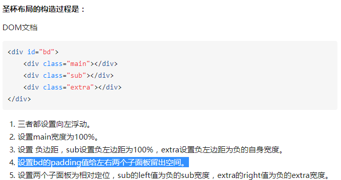

# 三栏布局 
> 左右定宽，中间自适应，并且中间内容优先渲染中间的盒子内容

margin 及 padding的百分比是按照，**父元素的width**作为计算单位，设置padding:50%绘制正方形

## 圣杯布局

  
1.margin 在float元素相反的方向上会失效，所以无法在main上使用 margin-right。

2.在水平块状元素上（未给定宽度,父容器的100%） 使用padding-left 及 padding-right 改变父容器的元素尺寸(减小它的宽度,总体尺寸不会改变这点类似于box-sizing:border-box)，就是利用这个特性;
所以在父元素上使用 padding:0 200px; 给左、右预留空间。

在float元素 width设置为100% 此时设置padding:0 200px 会增大元素的尺寸。所以出现了box-sizing:border-box

3.直接在 main 上使用 padding:0 200px; box-sizing:border-box; 这样就给左右两边的盒子预留空间(不需要在sub,extra两个元素使用)。2006年还不支持 box-sizing属性，**所以使用了在父容器 bd上使用padding来完成**。

## 淘宝双飞翼：
使用一个 div 元素来装内容，并配备margin-left 及margin-right来控制。减少了css的使用 ，不需要第4条和第5条

.main元素是float，float元素是带方向性质水平排列，所以兄弟float元素的 负margin 可以把元素

## 总结
1. 默认的盒子模型 width 只包括content-box,不包含padding及border
> 设置box-sizing:border-box之后 width = content-box + padding + border; 定宽的元素，设定padding值后会减小content-box的值
2. 默认定宽的元素 设定padding值后，width值不会改变，整体元素的尺寸会增大
## 参考文章
* https://www.zhihu.com/question/21504052

